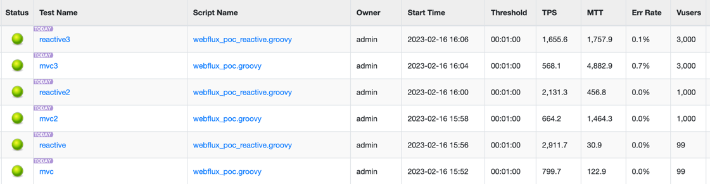

## MVC + JDBC vs Webflux + R2DBC

### 환경

- MySQL 8.0.32 (Docker)
- Java 17
- Spring Boot 3.0.2
- MVC
  - spring-boot-starter-web
  - spring-boot-starter-jdbc
- Webflux
  - spring-boot-starter-webflux
  - spring-boot-starter-data-r2dbc
- nGrinder

### 성능테스트

- 단순 조회 결과

